# Weighted A*: Moving target capture
(Cmd+Shift+V to go into markdown reader mode in Mac)
(Ctrl+Shift+V to go into markdown reader mode in Windows)

There are 3 files,
1. **main.py**: calls the _robotplanner_ and _targetplanner_ functions to calculate next moves
2. **robotplanner.py**: robot planner with A* implementation
3. **targetplanner.py**: target move planner (unchanged)

# **main.py**
Change map/start/target positions here. (Only edited/newly added functions have been described here).
## 1. function **params**
- Initializes the solver parameters (user variables)
    - **skip**: no. of moves to use from A* path that reduces computations
    - **epsilon**: weight for heuristic
## 2. function **runtest**
- **added on top of original code**: 
    - Checks if robot is far away from target -> uses previously computed path trajectory without calling _robotplanner_. Else recomputes path by calling _robotplanner_ and takes only 1 step.
    - added code to plot various data analysis (in results) and create gifs

# **robotplanner.py**
## 1. class **environment** 
Environment class that contains functions for parsing the environment
- **getSuccessors**: returns successors node (except obstacles) and stage cost
- **getHeuristic**: returns heuristic value 'h' for every node (Euclidean distance)

## 2. class **Node**
Used to create Node() object, that contains various node information like node id, node coordinates, g value, h value, parent coordinates, closed (true/false)

## 3. class **stateSpace**
Initializes map state space: OPEN list, node dictionary and START, GOAL nodes

## 4. class **aStar**
class containing functions for the A* path finding algorithm
- **solver**: solves for the optimal path using A* algorithm over the state space, changes node characteristics and sets the parent coordinates
- **recoverPath**: returns optimal path from START -> GOAL

## 5. function **robotplanner**
Calls the required functions for computing the optimal path using A*

# Results
|        GIF            |Path                   |
|-----------------------|-----------------------|
|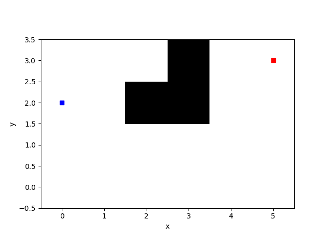 |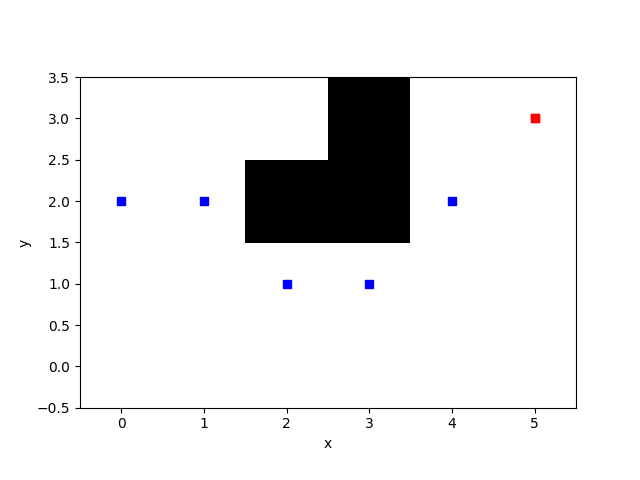 |
|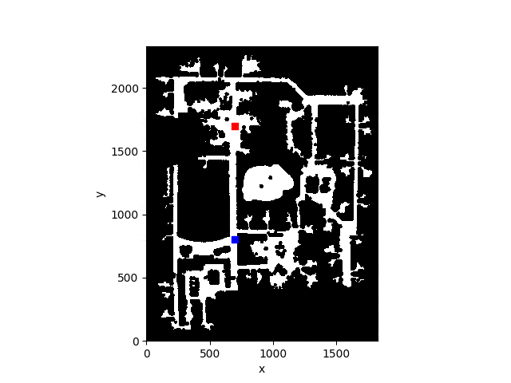 | |
|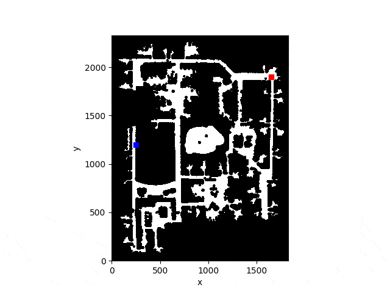| |
|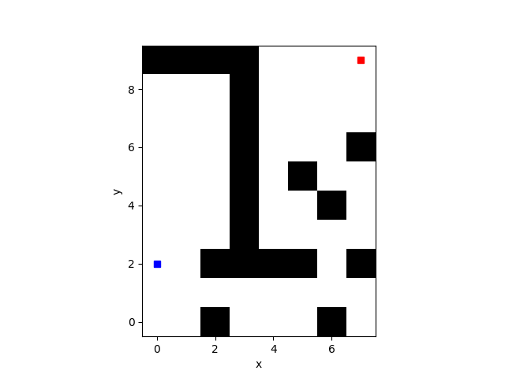 | |
|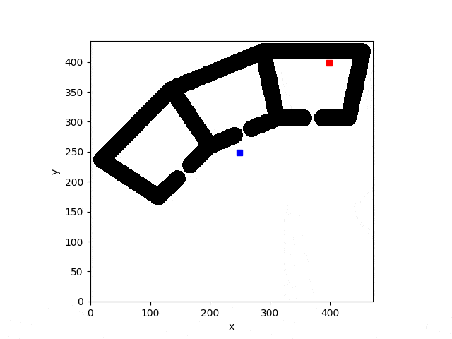 | |
|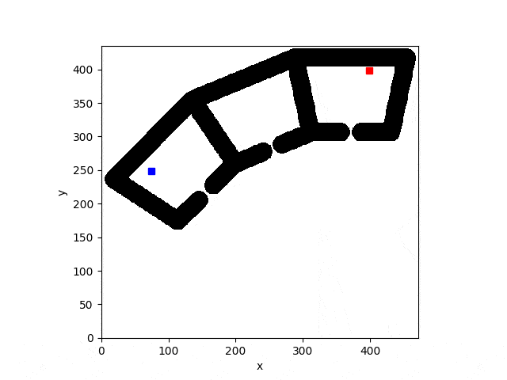| |
|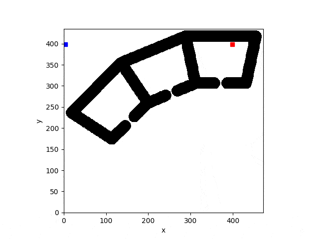| |
|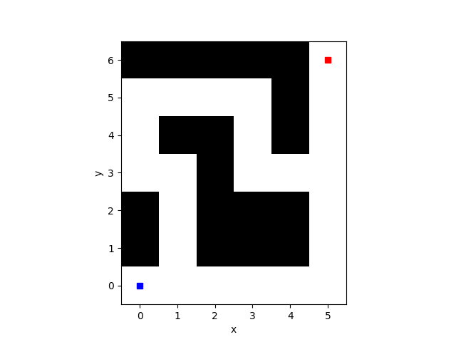 | |
|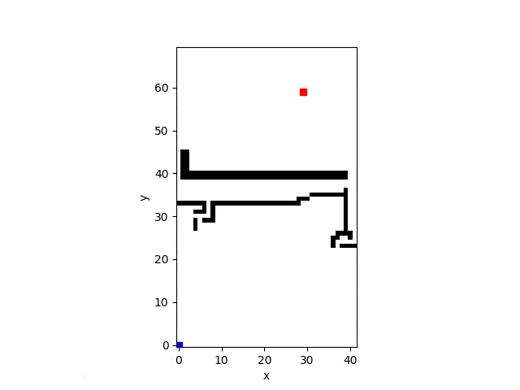 | |
|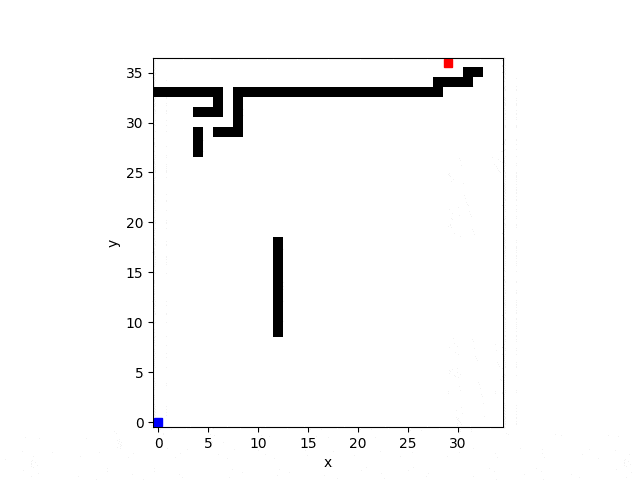 | |
