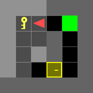
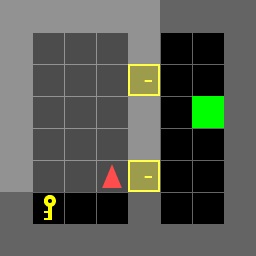
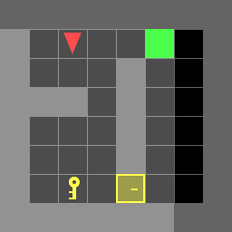

# Dynamic Programming: Door-Key problem
(Cmd+Shift+V to go into markdown reader mode in Mac)
(Ctrl+Shift+V to go into markdown reader mode in Windows)

There are 2 files,
1. **doorkey.py**: Part a & b
2. **policy_part_b.npy**: Pre computed policy for all states; reqd. for Part b)

# **doorkey.py** 
script is organized in following 5 parts;

## 1. class **problem_A** 
- **initvalueFunc**: Initializes the value function for x_T; highCost everywhere and 0 at the goals
- **stageCost**: Computes cost for a given state and input
- **nextState**: Computes next state (x_(t+1)) for a given state and input aka motion model
- **doorkey_problem**: Returns the optimal control sequence for a given environment 

## 2. class **problem_B**
- **initvalueFunc**: Initializes the value function for x_T; highCost everywhere and 0 at the goals
- **checkIfInGoal**: Checks if a current state is in a goal position
- **stageCost**: Computes cost for a given state and input
- **nextState**: Computes next state (x_(t+1)) for a given state and input aka motion model
- **generate_policy**: Generates single control policy for complete state space
- **run_saved_policy**: Runs saved policy to generate gif

## 3. **part_A**
Calls required functions and returns values/gifs to complete part a

## 4. **part_B**
Calls required functions and returns values/gifs to complete part b. You can choose amongst the following by commenting/uncommenting lines.
- Loading specific environments vs loading random environments
- Regenerate control policy again or just run the policy over an environment

Remember to change the location of the **policy_part_b.npy** file in this function, if running on a local machine.

## 5. **if __name__ == '__main__'**
Calls the coressponding problem parts a & b

# Results

|                                     |                                        |                                        |                                        |                                        |
|-------------------------------------|----------------------------------------|----------------------------------------|----------------------------------------|----------------------------------------|
|  |  |  |||
|      |      |      |      |      |
|      |      |      |      |      |
|      |      |      |      |      |
|      |      |      |      |      |
|      |      |      |      |      |
|      |      |      |      |      |
|      |      |      |      |      |
|      |  |  || |

